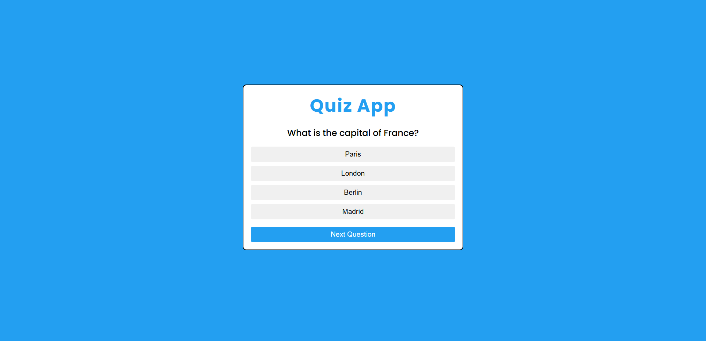
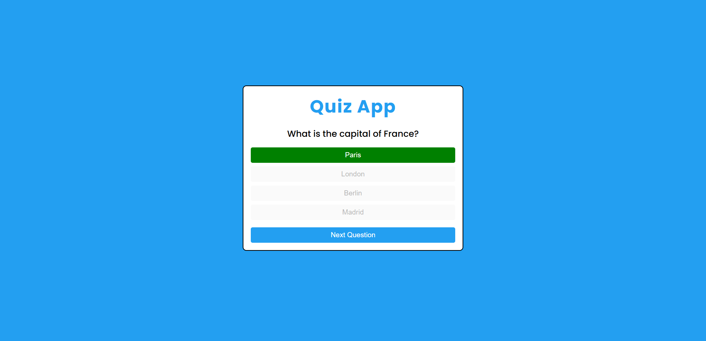
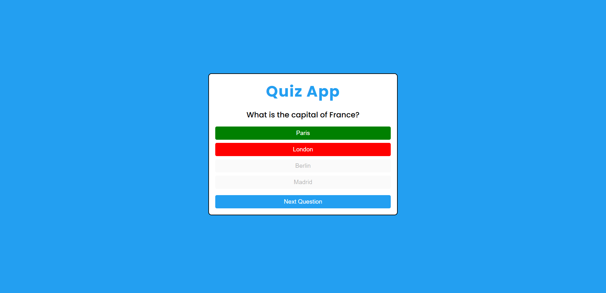
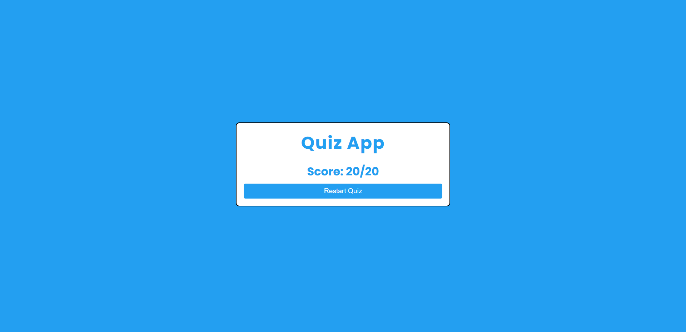

# 🎯 Quiz App

A responsive, browser-based multiple-choice quiz built with **HTML, CSS, and JavaScript**. The app displays one question at a time, gives instant visual feedback, tracks the score, and lets users restart the quiz.

---
## 👤 Author

**Vishal Sharma**  
GitHub: [vishalstream-dev](https://github.com/vishalstream-dev)

Built as a hands-on project to practise JavaScript fundamentals, DOM manipulation, and event handling.

---

## 📸 Screenshots

Add screenshots of your app here so visitors can see how it looks before running it.

Create a folder named `screenshots` in the project root, save your images there, and use the following paths (change the filenames to match your screenshots):

### Quiz question



### Correct



### Incorrect



### Final score



---

## ✨ Features

- 20 multiple-choice questions
- Four answer options per question
- Displays one question at a time
- Highlights the correct answer in green
- Highlights the selected wrong answer in red
- Disables all answer options after a selection to prevent repeated answers
- Enables **Next Question** only after an answer is selected
- Tracks the user's score
- Shows the final score after the last question
- **Restart Quiz** resets the quiz and score
- Simple, centered interface styled with CSS
- Runs directly in the browser without a build step or package installation

---

## 🛠️ Technologies Used

- **HTML5** — page structure and quiz elements
- **CSS3** — layout, colors, spacing, and answer-state styling
- **JavaScript (ES6+)** — question data, DOM manipulation, event listeners, answer checking, score tracking, and restart logic

---

## 📁 Project Structure

```text
Quiz-App/
├── index.html
├── style.css
├── script.js
├── README.md
└── screenshots/
    ├── quiz-question.png
    ├── answer-feedback.png
    └── final-score.png
```
---

## 🚀 Getting Started

### Run locally

1. Download or clone this repository.
2. Open the project folder.
3. Open `index.html` in a modern web browser.
4. Select an answer for each question.
5. Click **Next Question** to move forward.
6. View your final score and select **Restart Quiz** to try again.

No dependencies, package manager, or build tools are required.

### Clone from GitHub

```bash
git clone https://github.com/vishalstream-dev/Quiz-App.git
cd Quiz-App
```

Then open `index.html` in your browser.

---

## 🧠 How It Works

1. Questions are stored in an array of JavaScript objects. Each object contains the question text, answer options, and correct answer.
2. JavaScript selects the current question using a question index.
3. The app creates answer buttons dynamically and adds click event listeners.
4. When the user chooses an answer, the app compares it with the correct answer.
5. The selected answer is checked, the correct answer is highlighted, and the score increases only for a correct selection.
6. The **Next Question** button moves to the next question after an answer is selected.
7. After the last question, the app displays the score as the number of correct answers out of the total.
8. Restarting resets the question index and score, then displays the first question again.

---

## 🔮 Future Improvements

Ideas for future versions:

- [ ] Add a progress bar showing question number (for example, 4 of 20)
- [ ] Shuffle the questions each time the quiz starts
- [ ] Randomize the order of answer options
- [ ] Add a countdown timer for each question or for the whole quiz
- [ ] Add difficulty levels such as Easy, Medium, and Hard
- [ ] Group questions into categories (HTML, CSS, JavaScript, general knowledge)
- [ ] Show score percentage and a performance message at the end
- [ ] Provide explanations for correct answers
- [ ] Add a review screen showing each question and the user's answer
- [ ] Save best score using `localStorage`
- [ ] Add sound or subtle animations for answer feedback
- [ ] Improve accessibility with keyboard support and clearer focus styles
- [ ] Add a start screen and quiz settings
- [ ] Load questions from an external JSON file or API
- [ ] Add a mobile-first UI polish pass

These are planned ideas, not features currently implemented.

---

## 🧪 Testing Checklist

- [x] First question displays on page load
- [x] Selecting an answer highlights the correct answer
- [x] Correct answers increase the score
- [x] Answer buttons disable after a selection
- [x] Next Question moves through the quiz
- [x] Final score appears after the last question
- [x] Restart resets the quiz and score

---

## 📄 License

This project is open for learning and personal practice. If you plan to add a formal open-source license, choose one and add its license file to the repository.